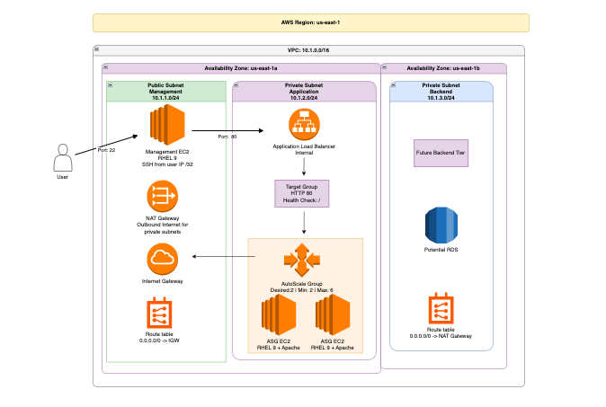

# SRE AWS Technical Challenge

## Solution Overview

This repository contains a proof-of-concept AWS environment built with Terraform for the SRE AWS Technical Challenge. The environment deploys a segmented AWS network with a public management tier, private application tier, private backend tier, internal Application Load Balancer, Auto Scaling Group, NAT Gateway, and basic Apache web servers running on RHEL 9.

The goal of this design is to demonstrate secure network segmentation, controlled administrative access, private application hosting, and operational thinking around deployment, monitoring, availability, and future improvements.

## Architecture Diagram



### High-Level Flow

1. A user/admin connects to the Management EC2 instance over SSH.
2. The Management EC2 instance can access the internal Application Load Balancer over HTTP.
3. The internal ALB forwards traffic to Apache web servers running in an Auto Scaling Group.
4. Application EC2 instances are private and use a NAT Gateway for outbound package installation and updates.
5. VPC Flow Logs are enabled and sent to CloudWatch Logs.

## Architecture Summary

| Component | Description |
|---|---|
| Region | `us-east-1` |
| VPC | `10.1.0.0/16` |
| Management Subnet | Public subnet `10.1.1.0/24` |
| Application Subnet | Private subnet `10.1.2.0/24` |
| Backend Subnet | Private subnet `10.1.3.0/24` |
| Management EC2 | RHEL 9 instance used for SSH/jump-host access |
| Application EC2s | RHEL 9 Apache web servers deployed through an Auto Scaling Group |
| Auto Scaling Group | Desired 2, Minimum 2, Maximum 6 instances |
| Load Balancer | Internal Application Load Balancer |
| NAT Gateway | Provides outbound internet access for private subnets |
| Logging | VPC Flow Logs to CloudWatch Logs |

## Repository Structure

```text
.
├── README.md
├── versions.tf
├── variables.tf
├── terraform.tfvars.example
├── main.tf
├── security-groups.tf
├── compute.tf
├── alb.tf
├── nat.tf
├── outputs.tf
├── user_data/
│   └── apache.sh
├── tech_arch_diagram.png
└── evidence/
    ├── terraform-output.txt
    ├── alb-curl-test.txt
    └── target-health.txt
```

## Deployment Instructions

### Prerequisites

Before deploying, make sure the following tools are installed and configured:

- Terraform
- AWS CLI
- AWS credentials with permissions to create VPC, EC2, Auto Scaling, ALB, IAM, CloudWatch Logs, NAT Gateway, and related networking resources
- Existing EC2 key pair in the target AWS region

Confirm AWS access:

```bash
aws sts get-caller-identity
```

### Configure Variables

Copy the example variables file:

```bash
cp terraform.tfvars.example terraform.tfvars
```

Update `terraform.tfvars` with your values:

```hcl
aws_region       = "us-east-1"
allowed_ssh_cidr = "YOUR_PUBLIC_IP/32"
key_name         = "YOUR_EC2_KEYPAIR_NAME"
```

Example:

```hcl
aws_region       = "us-east-1"
allowed_ssh_cidr = "96.231.251.189/32"
key_name         = "mikeg_key3"
```

`terraform.tfvars` is intentionally ignored by Git so local IPs and key pair names are not committed.

### Deploy

Initialize Terraform:

```bash
terraform init
```

Format and validate:

```bash
terraform fmt -recursive
terraform validate
```

Review the plan:

```bash
terraform plan -out=tfplan
```

Apply the plan:

```bash
terraform apply tfplan
```

After deployment, view outputs:

```bash
terraform output
```

Expected outputs include:

```text
alb_dns_name
application_asg_name
management_public_ip
vpc_id
```

## Validation and Testing

Because the ALB is internal, it is not reachable directly from the public internet. To test the application, SSH into the Management EC2 instance first.

```bash
ssh -i /path/to/key.pem ec2-user@<management_public_ip>
```

From the Management EC2 instance, test the internal ALB:

```bash
curl http://<alb_dns_name>
```

Expected response:

```html
<html>
  <head>
    <title>SRE Technical Challenge</title>
  </head>
  <body>
    <h1>SRE Technical Challenge</h1>
    <p>Apache is running on RHEL 9.</p>
    <p>Hostname: ip-10-1-2-xxx.ec2.internal</p>
  </body>
</html>
```

Check ALB target health:

```bash
TG_ARN=$(aws elbv2 describe-target-groups \
  --names sre-app-tg \
  --region us-east-1 \
  --query 'TargetGroups[0].TargetGroupArn' \
  --output text)

aws elbv2 describe-target-health \
  --target-group-arn "$TG_ARN" \
  --region us-east-1
```

Target health should show the application instances as `healthy`.

## Design Decisions and Assumptions

### Internal Application Load Balancer

The challenge requires three subnets: Management, Application, and Backend. Management is public, while Application and Backend are private. Since an internet-facing ALB generally requires public subnets across multiple Availability Zones, this POC uses an internal ALB placed across private subnets.

This keeps the application tier private and avoids exposing app EC2 instances directly to the internet. In a production internet-facing design, I would add a second public subnet in another Availability Zone and place a public ALB across those public subnets while keeping application EC2 instances private.

### Management Subnet

The Management subnet is public and contains the Management EC2 instance. This is the only EC2 instance intended to be reachable from the internet. SSH access is restricted to a single approved `/32` source IP.

### Private Application Subnet

The Application subnet contains the Auto Scaling Group and Apache web servers. These instances do not have public IP addresses and only allow:

- HTTP from the ALB security group
- SSH from the Management security group

### Backend Subnet

The Backend subnet is reserved for future private services, such as RDS or internal application components. No public access is allowed.

### NAT Gateway

A NAT Gateway was added so private application instances can reach outbound package repositories during bootstrapping. This allows user data to install Apache while keeping the instances private.

### Apache Installation

Apache is installed through EC2 user data. The script installs `httpd`, writes a basic index page, enables the service, and starts Apache.

## Security Controls

### Management Security Group

Inbound:

- SSH `22` from approved user IP `/32`

Outbound:

- Allowed for administrative access and troubleshooting

### ALB Security Group

Inbound:

- HTTP `80` from inside the VPC CIDR `10.1.0.0/16`

Outbound:

- Allowed to application instances

### Application Security Group

Inbound:

- HTTP `80` from the ALB security group
- SSH `22` from the Management security group

Outbound:

- Allowed through the NAT Gateway for package installation and updates

### Network Segmentation

The environment separates access by subnet purpose:

- Public subnet: Management only
- Private subnet: Application workloads
- Private subnet: Backend/future data tier

Application instances are not directly internet-accessible.

## Operational Analysis

### Security Gaps

- The ALB currently uses HTTP instead of HTTPS.
- SSH access is still used for management; a stronger production approach would use AWS Systems Manager Session Manager.
- No AWS WAF is configured in front of the load balancer.
- IAM policies created by the VPC module should be reviewed for least privilege.
- No centralized host-level log collection is configured for Apache logs.

### Availability Gaps

- The Auto Scaling Group is currently tied to the application subnet. A production design should include application subnets in multiple Availability Zones.
- The backend tier is only reserved and does not yet include a multi-AZ database.
- The NAT Gateway is a single NAT Gateway. For higher availability, NAT Gateways should be deployed per AZ.
- No Route 53 health checks or DNS failover are configured.

### Cost Optimization Opportunities

- The environment uses `t2.micro` instances as required by the challenge.
- NAT Gateway introduces hourly and data processing cost; for a small POC, this should be destroyed when not needed.
- Scheduled scaling could reduce costs for non-production workloads.
- CloudWatch retention and log volume should be reviewed to manage long-term logging costs.
- A golden AMI with Apache preinstalled could reduce boot time and reduce dependency on NAT during instance launch.

### Operational Shortcomings

- No automated backup strategy is currently implemented.
- No CloudWatch alarms are configured for unhealthy ALB targets, EC2 CPU, or ASG capacity.
- No CI/CD pipeline is configured for Terraform validation or deployment.
- No automated patching strategy is defined.
- No incident notification system is configured.

## Improvement Plan

| Priority | Improvement | Reason |
|---|---|---|
| P1 | Add CloudWatch alarm for unhealthy ALB targets | Faster detection of application outages |
| P1 | Add HTTPS listener with ACM certificate | Protect traffic in transit |
| P1 | Use SSM Session Manager instead of SSH | Reduce public SSH exposure and remove need to manage private keys |
| P1 | Add multi-AZ application subnets | Improve resilience of the application tier |
| P2 | Add AWS WAF | Improve protection against common web attacks |
| P2 | Add Apache/application log forwarding to CloudWatch | Improve troubleshooting and observability |
| P2 | Add golden AMI or image pipeline | Faster and more reliable instance bootstrapping |
| P2 | Add NAT Gateway per AZ | Improve outbound availability for private subnets |
| P3 | Add CI/CD pipeline for Terraform | Improve code quality and repeatable deployments |
| P3 | Add cost controls and budget alerts | Prevent unexpected spend |

## Implemented Improvements

### 1. NAT Gateway for Private Subnet Egress

During testing, private application instances needed outbound internet access to install Apache packages from RHEL repositories. A NAT Gateway was added to allow private instances to install packages while remaining inaccessible from the public internet.

### 2. Security Group Hardening

Security groups were configured to limit access paths:

- Management EC2 allows SSH only from an approved `/32`.
- ALB allows HTTP only from the VPC CIDR.
- Application EC2 instances allow HTTP only from the ALB security group.
- Application EC2 instances allow SSH only from the Management security group.

### 3. ASG Health Check Grace Period

The ASG health check grace period was increased to allow more time for user data bootstrapping before the load balancer marks instances unhealthy.

## Runbook

### Deploy Environment

```bash
terraform init
terraform fmt -recursive
terraform validate
terraform plan -out=tfplan
terraform apply tfplan
```

### Validate Environment

```bash
terraform output
```

SSH to the Management EC2:

```bash
ssh -i /path/to/key.pem ec2-user@<management_public_ip>
```

Test ALB from the Management EC2:

```bash
curl http://<alb_dns_name>
```

### Check Target Health

```bash
TG_ARN=$(aws elbv2 describe-target-groups \
  --names sre-app-tg \
  --region us-east-1 \
  --query 'TargetGroups[0].TargetGroupArn' \
  --output text)

aws elbv2 describe-target-health \
  --target-group-arn "$TG_ARN" \
  --region us-east-1
```

### Respond to EC2 Instance Outage

1. Check ALB target health.
2. Confirm the ASG desired, minimum, and maximum capacity.
3. Check whether the ASG is replacing unhealthy instances.
4. SSH to the Management EC2.
5. From Management EC2, SSH to the private app instance if needed.
6. Check Apache:

```bash
sudo systemctl status httpd
curl localhost
sudo tail -100 /var/log/cloud-init-output.log
```

7. If Apache failed to install, confirm NAT Gateway and private route table configuration.
8. If needed, refresh the ASG:

```bash
aws autoscaling start-instance-refresh \
  --auto-scaling-group-name sre-app-asg \
  --region us-east-1
```

### Respond to ALB 502 Error

A `502 Bad Gateway` from the ALB usually means the ALB is reachable but the targets are unhealthy or not responding.

Troubleshooting steps:

1. Check target health.
2. Confirm Apache is running on app EC2s.
3. Confirm app security group allows HTTP from ALB security group.
4. Confirm target group health check path is `/`.
5. Check cloud-init logs for user data errors.
6. Confirm private subnet instances have outbound access through NAT Gateway.

### Restore Data if an S3 Bucket Were Deleted

This deployment does not currently create an S3 bucket. If an S3 bucket were added for backups or static assets, the recovery approach would be:

1. Enable S3 versioning.
2. Enable lifecycle policies.
3. Optionally enable cross-region replication.
4. If an object is deleted, remove the delete marker or restore a previous object version.
5. If the bucket itself is deleted, recreate it through Terraform and restore objects from backup or replicated copies.

## Evidence of Deployment

Deployment evidence is stored in the `evidence/` directory.

Recommended evidence files:

```text
evidence/terraform-output.txt
evidence/alb-curl-test.txt
evidence/target-health.txt
```

### Successful ALB Test

The application was successfully tested from the Management EC2 instance using the internal ALB DNS name. The ALB returned the Apache page running on a private application EC2 instance.

Example result:

```html
<html>
  <head>
    <title>SRE Technical Challenge</title>
  </head>
  <body>
    <h1>SRE Technical Challenge</h1>
    <p>Apache is running on RHEL 9.</p>
    <p>Hostname: ip-10-1-2-xxx.ec2.internal</p>
  </body>
</html>
```

## Cleanup

To avoid ongoing AWS charges, destroy the environment after testing:

```bash
terraform destroy
```

Confirm with:

```text
yes
```

Resources that may incur cost include:

- EC2 instances
- Application Load Balancer
- NAT Gateway
- EBS volumes
- CloudWatch Logs
- Elastic IP

## References

- Terraform AWS Provider Documentation
- AWS VPC Documentation
- AWS Application Load Balancer Documentation
- AWS Auto Scaling Group Documentation
- AWS NAT Gateway Documentation
- AWS Security Group Documentation
- Coalfire Terraform AWS modules
